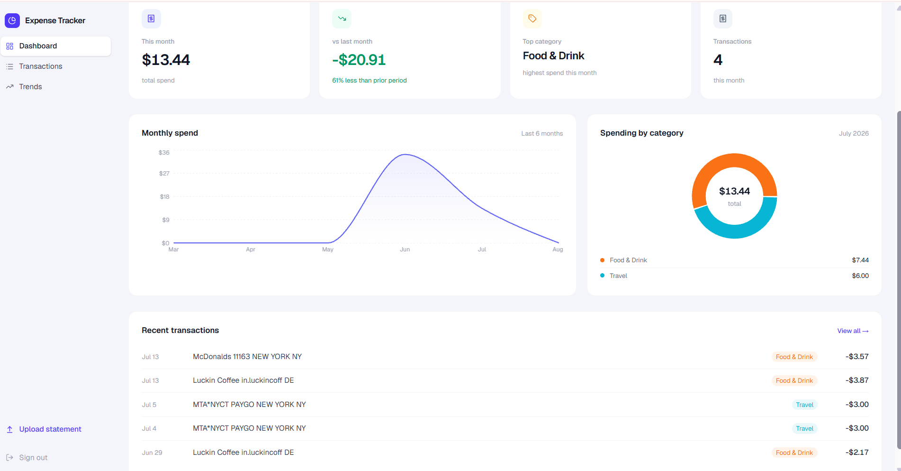
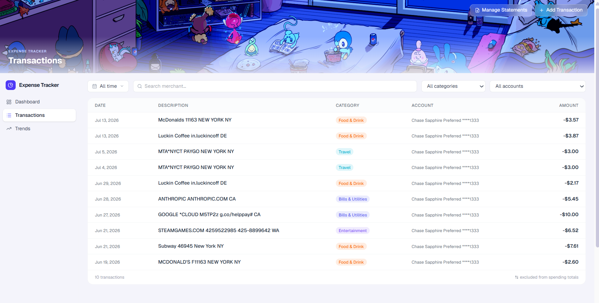
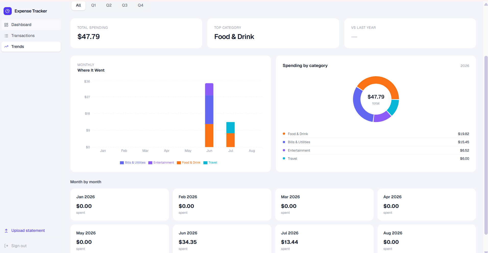
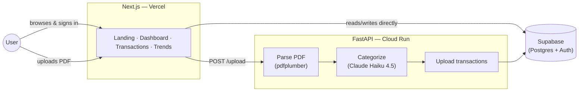

# Expense Tracker

A personal expense tracker that ingests bank and credit card PDF statements, categorizes every transaction with an LLM, and shows you exactly where your money went — no manual entry, and no bank account linking required.

**[Try it out here!](https://finance-tracking-nine-mu.vercel.app)**

<p align="center">
  
</p>

<p align="center">
  
  
</p>

## Why

I'd used a few expense trackers before this, and never liked any of them enough to pay for a subscription. The goal here was simple: track spending across accounts without manual entry or category tagging, with just enough spreadsheet-like interactivity (search, filter, inline edit) to feel familiar. It's also been a good excuse to practice full-stack development and see what Claude can actually do in a real pipeline — parsing PDF statements directly, categorizing every transaction, and caching merchant categories so a repeat charge is instant (and free) after the first pass.

## Features

- **Upload PDF statements** from Chase, Capital One, Bank of America, or Marcus (Goldman Sachs) — account type and card product are auto-detected, no manual setup
- **LLM categorization** into 12 spending categories, backed by a shared merchant cache so a merchant is only ever categorized once across all users
- **Dashboard** — this month's total spend, month-over-month change, top category, a 6-month trend, and a category breakdown for the current month
- **Transactions table** — search, date/category/account filters, inline editing, and manual entry for anything outside a statement
- **Spending trends** — quarter/year filtering, a stacked bar by category, and a year-over-year comparison
- **Spend-inclusion transparency** — a small ↔ icon flags any row (transfers, credit card payments, income) that's intentionally excluded from your spending totals

## Limitations

- **Statement cadence, not real-time.** Most banks issue statements monthly, so there's an inherent lag between a purchase and it showing up here — this isn't a live bank feed (Plaid-style), and it isn't trying to be one.
- **`Internal Transfers` is always excluded from spending, on purpose.** Reliably telling a true self-to-self transfer (checking → savings) apart from real incoming cash (a Zelle from a friend) isn't possible without every account uploaded, which most users won't do. The tradeoff: transfers never inflate your totals, but a P2P payment you received also won't count as income unless you recategorize it by hand on the Transactions page.
- **Categorization is a shared cache, not a personal one.** The merchant → category mapping is global. Correcting a transaction fixes that one row; the same merchant on a future upload still gets the old category until a per-user override table exists.
- **4 banks supported today**: Chase, Capital One, Bank of America, and Marcus — these are simply the accounts I use myself. A more robust version could use the Plaid API instead of parsing PDFs directly, but that requires going through its own authorization process.
- **No recurring-charge detection, net worth tracking, or credit score** — deliberately out of scope. This is a spending tracker, not a full financial dashboard.

## Architecture



The frontend talks to Supabase directly for everything — auth, dashboard reads, inline edits — except PDF upload. The backend exists solely for the parse → categorize → write pipeline, so most page loads never touch it.

## Tech stack

| | |
|---|---|
| Frontend | Next.js 16 (App Router), React 19, Tailwind CSS 4, Recharts, Framer Motion |
| Backend | FastAPI, pdfplumber, Anthropic Claude Haiku 4.5 |
| Data | Supabase (Postgres + Auth) |
| Deploy | Vercel (frontend), Google Cloud Run (backend, Docker), managed with `uv` |

## Notable engineering decisions

- **Local rules before the LLM** — credit card payment rows are caught by regex before ever reaching Claude, cutting API calls and latency for the most common transaction type.
- **Bank-agnostic parsing** — account type and card product are detected via weighted regex signal scoring across the whole statement.
- **Two-tier categorization cache** — a shared `merchant_categories` cache means the first user to see a merchant pays the LLM cost; every user after gets it free. Per-row corrections don't affect anyone else's categorization.

## Running locally

**Backend** (needs `SUPABASE_URL`, `SUPABASE_SERVICE_KEY`, `ANTHROPIC_API_KEY` in `backend/.env`):
```bash
cd backend
uv sync
uv run uvicorn api:app --reload
```

**Frontend** (needs `NEXT_PUBLIC_SUPABASE_URL`, `NEXT_PUBLIC_SUPABASE_ANON_KEY`, `NEXT_PUBLIC_API_URL` in `frontend/.env.local`):
```bash
cd frontend
npm install
npm run dev
```

Both servers need to be running for uploads to work locally — the frontend falls back to `http://localhost:8000` if `NEXT_PUBLIC_API_URL` isn't set.
