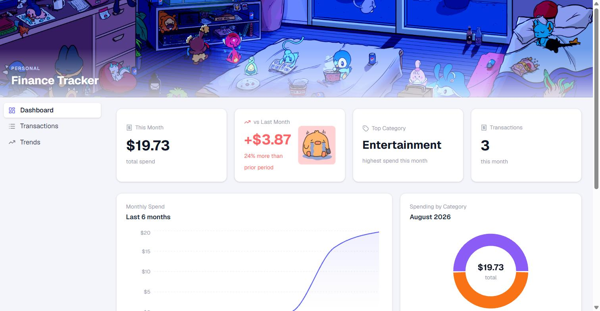
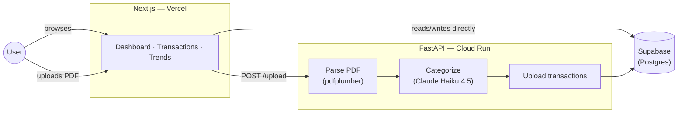

# Finance Tracker

A personal finance app that ingests bank/credit card PDF statements, categorizes every transaction with an LLM, and visualizes spending across accounts — no manual data entry.

**[Live demo](https://finance-tracking-nine-mu.vercel.app)** · 🎥 Video demo: _coming soon_



## Why

Tracking spending across multiple banks means either manually categorizing hundreds of transactions or trusting a budgeting app's shaky auto-categorization. This app parses PDF statements directly, uses Claude to categorize each transaction, and caches merchant categories so repeat charges are instant and free after the first pass.

## Features

- Upload PDF statements from Chase, Capital One, Bank of America, or Marcus (Goldman Sachs) — auto-detects account type and card product
- LLM categorization into 12 spending categories, with a shared merchant cache and per-user overrides
- Dashboard with monthly spend, category breakdown, and net accumulated (income − true spending)
- Transactions table with search, filters, inline editing, and manual entry
- Spending trends by quarter/year with category-stacked charts

## Architecture



The frontend talks to Supabase directly for everything except PDF upload — the backend only exists for the parse → categorize → write pipeline, so most page loads never touch it.

## Tech stack

| | |
|---|---|
| Frontend | Next.js 14, Tailwind CSS, Recharts, Framer Motion |
| Backend | FastAPI, pdfplumber, Anthropic Claude Haiku 4.5 |
| Data | Supabase (Postgres + Auth) |
| Deploy | Vercel (frontend), Google Cloud Run (backend, Docker), managed with `uv` |

## Notable engineering decisions

- **Local rules before the LLM** — credit card payment rows are caught by regex before ever reaching Claude, cutting API calls and latency for the most common transaction type.
- **Bank-agnostic parsing** — account type and card product are detected via weighted regex signal scoring across the whole statement, not per-bank if/else branches, so adding a new bank format doesn't touch existing ones.
- **Two-tier categorization cache** — a shared `merchant_categories` cache means the first user to see a merchant pays the LLM cost; every user after gets it free. Per-user overrides let one person's correction not affect anyone else's categorization.

## Running locally

**Backend** (needs `SUPABASE_URL`, `SUPABASE_SERVICE_KEY`, `ANTHROPIC_API_KEY` in `backend/.env`):
```bash
cd backend
uv sync
uv run uvicorn api:app --reload
```

**Frontend** (needs `NEXT_PUBLIC_SUPABASE_URL`, `NEXT_PUBLIC_SUPABASE_ANON_KEY`, `NEXT_PUBLIC_API_URL` in `frontend/.env.local`):
```bash
cd frontend
npm install
npm run dev
```

## License

MIT
